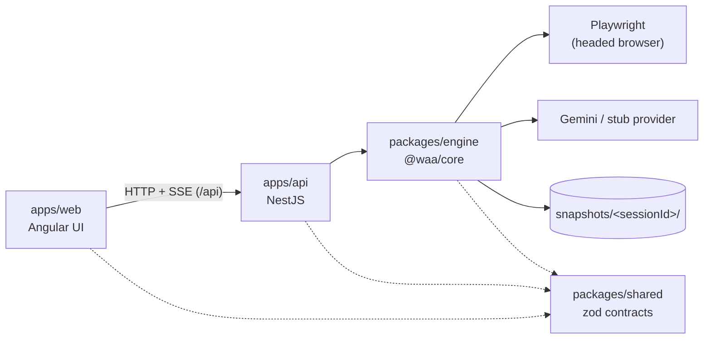

# Web Access Advisor

Record a browsing session in a real, headed browser; replay it with snapshot capture (HTML + axe-core + screenshots, gated by DOM-change detection); get AI-assisted accessibility findings merged with axe violations. Sessions persist under `./snapshots/<sessionId>/` and remain loadable across versions.

The headline feature is first-class login handling:

- **Auth segments at recording time** — mark "I'm logging in now" and every action in the segment is discarded before it reaches disk. Credentials never appear in `recording.json`; only a checkpoint marker and a saved `storageState.json` remain.
- **Pause-for-login during replay** — when a replay hits a login wall, it pauses with the browser open, tells the UI, and waits for you to sign in. It then validates the live page, saves fresh storage state for reuse, and resumes from the paused step.

Stack: Angular (standalone, signals, zoneless) + NestJS + a framework-free Playwright engine, in plain npm workspaces. Decision records live in [docs/adr/](docs/adr/); the working plan is [docs/rewrite-plan.md](docs/rewrite-plan.md).

## Quickstart (Windows)

Prerequisites: Node.js 22.9+ (developed on 24.x) and npm.

```bat
git clone <repository-url>
cd web-access-advisor
npm install          :: postinstall downloads the Chromium + Firefox Playwright browsers
npm run build        :: builds packages/shared, packages/engine, apps/api, apps/web
npm run dev
```

`npm run dev` starts both apps:

| What | Where |
|---|---|
| Web UI (Angular dev server) | http://localhost:4300 |
| API (NestJS) | http://localhost:3002/api — health at [/api/health](http://localhost:3002/api/health) |
| Swagger UI | http://localhost:3002/api/docs |

The dev server proxies `/api` to port 3002, so the UI talks to the API with no CORS setup. AI analysis needs a `GEMINI_API_KEY` (see Configuration); without one the tool still works end-to-end using the stub provider (axe-only results, no cloud calls).

## How a session works

1. **Record** — a headed Playwright browser opens; every click/type/navigation is captured with ranked locator candidates (`data-testid` → stable id → ARIA role+name → text → stable CSS → nth-child). Sensitive inputs never emit values. If you sign in during recording, toggle the login segment (or accept the auto-detect prompt) so credentials are discarded and a checkpoint marker is saved instead.
2. **Analyze** — the recording is replayed step by step. Snapshots (scrubbed HTML, axe-core results, screenshot) are captured whenever the DOM changed meaningfully. If the replay lands on a login wall — a recorded auth checkpoint without valid saved login state, a configured auth domain, or the login-wall heuristic — it pauses and the UI shows a banner: sign in **in the open browser**, press Continue, and the replay resumes. Timeout defaults to 10 minutes.
3. **Results** — AI findings (Gemini, batched with progressive context) merged with axe violations, per-step screenshots, corrected-code suggestions, CSV and print export.

Formats and events are documented in [docs/recording-format.md](docs/recording-format.md) (recording.json v2, v1 compatibility, manifest layout) and [docs/sse-events.md](docs/sse-events.md) (the SSE catalog the UI consumes). Auth flows (state machine diagrams, storageState lifecycle, security posture) are covered in [docs/auth-flows.md](docs/auth-flows.md). Saved logins (`storageState.json`) are encrypted at rest with AES-256-GCM under a per-user key (DPAPI-protected on Windows), so session directories cannot be copied to another user or machine.

## Configuration

Copy `.env.example` to `.env` (all variables optional; `npm run dev` loads it via `node --env-file-if-exists`):

| Variable | Default | Purpose |
|---|---|---|
| `GEMINI_API_KEY` | — | Enables Gemini analysis; unset → stub provider (axe-only) |
| `LLM_PROVIDER` | derived | Force `gemini` or `stub` |
| `HTTPS_PROXY` | — | Proxy for outbound Gemini requests only |
| `API_PORT` | `3003` | NestJS port (the web proxy targets 3002) |
| `SNAPSHOTS_DIR` | `./snapshots` | Session storage; relative to where the API starts (repo root) |
| `AUTH_DOMAINS_CONFIG` | `./config/auth-domains.json` | Auth-domain classification patterns |
| `PLAYWRIGHT_HEADLESS` | `false` | Headed by default — recording and pause-for-login need a visible browser |
| `REPLAY_AUTH_TIMEOUT_MS` | `600000` | How long a paused replay waits for sign-in |

[config/auth-domains.json](config/auth-domains.json) is user-editable: add your identity providers (hostname substrings and path patterns) and navigation to them is classified as authentication — no code change required.

## Architecture

| Workspace | Package | Responsibility |
|---|---|---|
| `apps/web` | `@waa/web` | Angular UI — setup, live recording feed, analysis progress, results. Talks to the API over HTTP/SSE only; never imports the engine |
| `apps/api` | `@waa/api` | NestJS API — disk-backed session store, per-session workers, SSE event streams, Swagger at `/api/docs` |
| `packages/shared` | `@waa/shared` | Zod v4 contracts — recording/manifest/analysis formats, API DTOs, SSE event union. Depends on zod only |
| `packages/engine` | `@waa/core` | Playwright engine — recorder, replayer with auth checkpoints, snapshotter, axe + LLM analysis. No HTTP framework imports |



Module boundaries are enforced by ESLint (`eslint.config.mjs`) and tsconfig path aliases — see [ADR 0002](docs/adr/0002-npm-workspaces-not-nx.md).

## Testing

```bat
npm test                                 :: all four workspaces
npm run test -w packages/shared          :: or any single workspace
```

- `packages/engine` includes real-browser smoke tests; set `WAA_SKIP_BROWSER_TESTS=1` to run only the fast unit tests.
- **Parity harness** — replays golden sessions from `./snapshots/` through the engine and compares against the committed v1 artifacts (action outcomes, step joins, axe rule-id overlap). Needs network access (golden sessions target live public sites): `npm run parity -- <sessionId>` (no args = all golden sessions). See `e2e/parity/compare-manifests.mjs` for the pass criteria.
- **Fixture site** — a static site with intentional a11y violations and a cookie-based fake login, used by the auth e2e tests: `npm run fixture:serve -- 5600` (default port 4300 collides with the dev server; pass a port when the UI is running).

## Legacy (v1)

The original React + Express implementation was removed from this branch at cutover. It is fully preserved at the git tag `v1-legacy` and on `main` — `git checkout v1-legacy` restores it. Sessions recorded by v1 under `snapshots/` remain loadable: the engine upgrades the v1 recording format in memory and never rewrites the files ([docs/recording-format.md](docs/recording-format.md)).
