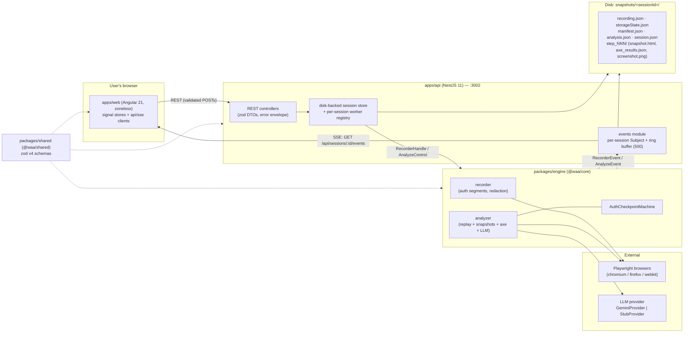

# Architecture

System overview of Web Access Advisor v2: record a browsing session in a real (headed) Playwright browser, replay it with snapshot capture (HTML + axe-core + screenshots, gated by DOM-change detection), and produce AI-assisted accessibility findings merged with axe violations. The headline feature is first-class login handling: **auth checkpoints at recording time** (credentials never touch disk) and **pause-for-login during replay** — see [auth-flows.md](./auth-flows.md).

Sources of truth (this document describes them; on any conflict the code wins):

- Workspace layout and boundaries: root `package.json` workspaces, [`eslint.config.mjs`](../eslint.config.mjs), `tsconfig.base.json`
- Engine surface: [`packages/engine/src/index.ts`](../packages/engine/src/index.ts) + [`engine-types.ts`](../packages/engine/src/engine-types.ts)
- API assembly: [`apps/api/src/app.factory.ts`](../apps/api/src/app.factory.ts), modules under `apps/api/src/*`
- Plan and history: [rewrite-plan.md](./rewrite-plan.md)

## Workspaces

Four TypeScript workspaces plus the e2e harness. Dependency direction is strictly downward — everything may depend on `@waa/shared`, nothing depends upward.

| Workspace | Package | Stack | Responsibility |
|---|---|---|---|
| `apps/web` | `@waa/web` | Angular 21 — standalone components, signals, **zoneless** change detection, typed forms, Tailwind v4 + Angular CDK primitives (no Material/PrimeNG, [ADR 0007](./adr/0007-tailwind-cdk-no-material.md)) | The UI. One HTTP surface (`core/api/api-client.ts`), one SSE surface (`core/api/sse-client.ts`), signal stores per flow, five routed pages (`/`, `/sessions`, `/sessions/:id/record`, `/sessions/:id/analyze`, `/sessions/:id/results`) |
| `apps/api` | `@waa/api` | NestJS 11, `nestjs-zod` 5, Swagger | Thin HTTP/SSE adapter over the engine: session store, per-session workers, recording/analysis/replay-auth/browsers/storage-state modules, SSE fan-out. See [api-reference.md](./api-reference.md) |
| `packages/shared` | `@waa/shared` | zod v4 **only** | Single source of truth for every contract: recording format v1/v2, manifest, analysis result, API DTOs, the SSE event union, auth-domains config ([ADR 0004](./adr/0004-zod-contracts.md)). No hand-written interfaces anywhere — types are `z.infer<>` exports |
| `packages/engine` | `@waa/core` | Playwright, axe-core, undici | The recording/replay/analysis engine. No HTTP framework imports; communicates via typed events/callbacks (`RecorderEvent`, `AnalyzeEvent`). Public API: `createRecorder`, `runAnalysis`, `loadRecording`/`saveRecording`, `AuthCheckpointMachine`, `validateStorageState`, `detectBrowsers`, LLM providers |
| `e2e/` | — | Node scripts + static fixture site | [Parity harness](./testing.md#the-parity-harness) and the [fixture login site](./testing.md#the-fixture-site) used by the engine's real-browser gate |

> Naming note: the engine package **directory** is `packages/engine` but its package **name** is `@waa/core` — the original `packages/core` path was occupied by the legacy engine until cutover and the directory was never renamed (rewrite-plan, Notes/deviations).

## Component diagram

All realtime traffic is server→client SSE; client→server commands are plain validated POSTs ([ADR 0003](./adr/0003-sse-over-websocket.md), [sse-events.md](./sse-events.md)).

## Module boundaries

Boundaries are plain npm workspaces + tsconfig path aliases, enforced by ESLint `no-restricted-imports` rules in [`eslint.config.mjs`](../eslint.config.mjs) — deliberately not Nx ([ADR 0002](./adr/0002-npm-workspaces-not-nx.md)):

| Scope | Rule (enforced by lint) | Why |
|---|---|---|
| `apps/web/**` | May not import `@waa/core` or `playwright` — **only `@waa/shared`** crosses into the browser bundle | The engine is server-side; the UI talks to it exclusively over HTTP/SSE |
| `packages/shared/**` | May not import `@waa/core`, `playwright`, `express`, `@nestjs/*`, `@angular/*` — zod is its only dependency | Contracts must load in every runtime (browser, Nest, engine, scripts) |
| `packages/engine/**` | May not import `@nestjs/*`, `express`, `@angular/*` | The engine communicates via typed events/callbacks ([`engine-types.ts`](../packages/engine/src/engine-types.ts)); the Nest adapter maps `RecorderEvent`/`AnalyzeEvent` onto SSE 1:1 |

Data shapes never live in the engine or apps: they come from `@waa/shared` ([ADR 0004](./adr/0004-zod-contracts.md)), parsed at every boundary — Nest request DTOs (`createZodDto` + global `ZodValidationPipe`), Angular response/SSE parsing, engine file-format validation.

## Per-session workers (vs v1's global singleton)

v1 had a single global recorder/analyzer instance — effectively single-user, with all state in memory. v2 replaces it with `SessionWorkerRegistry` ([`apps/api/src/sessions/session-worker.registry.ts`](../apps/api/src/sessions/session-worker.registry.ts)):

- A **worker** is the live Playwright resource behind one session: `{ kind: 'recording', recorder: RecorderHandle }` or `{ kind: 'analysis', control: AnalyzeControl, lastAuthState }`.
- **One live worker per session** — registering a second is a `409 Conflict`. Different sessions run concurrently (two profile-based recordings of the *same* browser profile still conflict at launch — the profile lock surfaces from the engine).
- **Graceful shutdown** (`enableShutdownHooks` + `onApplicationShutdown`): every live recorder is disposed and every paused analysis cancelled, so no orphaned browsers survive Ctrl+C.

## Disk-backed session store

`SessionStoreService` ([`apps/api/src/sessions/session-store.service.ts`](../apps/api/src/sessions/session-store.service.ts)) treats the **snapshots directory as the source of truth**, not process memory:

- New sessions get `snapshots/<id>/session.json` (status, timestamps, counts); derived facts (`hasStorageState`, `hasAnalysis`) are folded in from the files present at read time.
- **Legacy v1 sessions** (a `recording.json` but no `session.json`) are folded into listings read-only, with facts derived from the recording file (mtime-cached).
- **Interrupted marking**: at startup, any session left in a live status (`recording`, `replaying`, `awaiting-auth`, `analyzing`) by a dead process is patched to `interrupted` — visible and recoverable, never vanished.
- Deleting a session removes the whole directory and drops its SSE channel; deletion is refused (`409`) while a worker is live.

On-disk layout of a session directory is specified in [recording-format.md § On-disk session layout](./recording-format.md#on-disk-session-layout).

## Data flow — the two big journeys

### Record

1. UI `POST /api/sessions` (URL, browser, profile, optional `reuseStorageStateFrom` — deep-validated before launch). API creates `session.json`, launches the engine recorder (headed browser), registers a `recording` worker, returns `201`.
2. UI connects `GET /api/sessions/:id/events` (SSE) and routes to `/sessions/:id/record`.
3. The injected in-page script + `framenavigated` listener turn user activity into `ActionV2`s (ranked locator candidates, sensitive values redacted at the source). Each becomes a `recording.action` / `recording.navigated` event feeding the live action feed.
4. Login handling: the user toggles a login segment (or confirms a `recording.auth_suspected` prompt) — segment actions are **discarded**, only an `AuthCheckpoint` marker persists, and `storageState.json` is saved at segment end. Full detail: [auth-flows.md](./auth-flows.md).
5. `POST /:id/recording/stop` → engine writes `recording.json` (format v2), closes the browser; API patches status to `recorded`. Closing the browser window instead triggers the same stop path (or marks the session `interrupted` if persisting fails).

### Analyze

1. UI `POST /api/sessions/:id/analysis` → `202` immediately; the API loads `recording.json` (v1 files upgraded in memory), starts `runAnalysis`, registers an `analysis` worker. All progress arrives over SSE (`analysis.progress`, phases `replaying-actions → capturing-snapshots → running-accessibility-checks → processing-with-ai → generating-report → completed`).
2. The engine replays each action via the candidate fallback chain; per-action outcomes (`executed | skipped | failed`) are recorded. The DOM-change detector gates snapshot capture (HTML scrubbed before disk, axe scan, screenshot) into `step_NNN/`.
3. If replay hits a recorded auth checkpoint without a validated saved login — or a live login wall — it **pauses** (`replay.auth_required`; session status `awaiting-auth`). The user signs in in the open browser and `POST /:id/replay/auth/continue` validates and resumes. See [auth-flows.md](./auth-flows.md).
4. Snapshots are batched to the LLM provider (Gemini, or Stub in tests/CI — [ADR 0006](./adr/0006-llm-provider-abstraction.md)); axe violations are consolidated and merged.
5. `manifest.json` + `analysis.json` are persisted; `analysis.complete` (or `analysis.error`) and a final `session.status` event fire; the UI fetches `GET /:id/analysis` and routes to results.

## Design decisions index

| ADR | Decision |
|---|---|
| [0001](./adr/0001-full-rewrite-angular-nest.md) | Full rewrite on Angular + NestJS (same repo; legacy preserved on `main` and tag `v1-legacy`) |
| [0002](./adr/0002-npm-workspaces-not-nx.md) | Plain npm workspaces, not Nx — boundaries via tsconfig aliases + ESLint rules |
| [0003](./adr/0003-sse-over-websocket.md) | SSE for all server→client realtime; commands are validated POSTs; `Last-Event-ID` + ring buffer for reconnects |
| [0004](./adr/0004-zod-contracts.md) | zod v4 schemas in `@waa/shared` as the single contract source (Nest DTOs, Angular boundary parsing, file formats) |
| [0005](./adr/0005-recording-format-v2-auth-checkpoints.md) | recording.json v2: auth checkpoints, target candidates, source-level redaction |
| [0006](./adr/0006-llm-provider-abstraction.md) | `LlmProvider` interface — Gemini via per-client undici dispatcher; Stub for tests/CI |
| [0007](./adr/0007-tailwind-cdk-no-material.md) | Tailwind + Angular CDK primitives, no component library — the tool's own UI is a test target |

Related references: [recording-format.md](./recording-format.md) (file formats), [sse-events.md](./sse-events.md) (event catalog), [api-reference.md](./api-reference.md) (routes + OpenAPI), [auth-flows.md](./auth-flows.md) (login handling), [development.md](./development.md), [testing.md](./testing.md).
