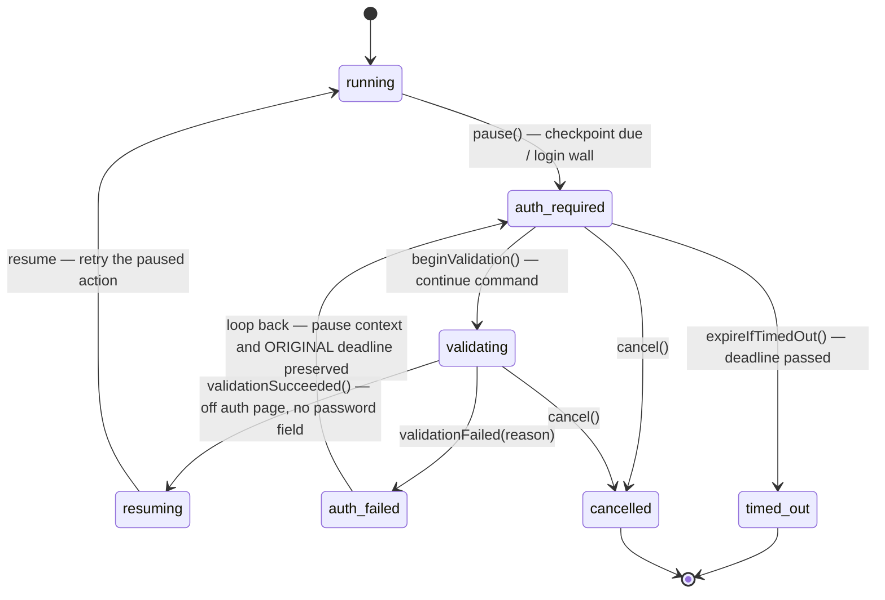

# Authentication flows

The headline feature of the v2 rewrite: **login segments at recording time** (credentials never touch disk) and **pause-for-login during replay** (a headed browser is kept alive on the login wall until the user signs in). This document covers both sides, the storage-state lifecycle that connects them, and the security posture.

Sources of truth (this document describes them; on any conflict the code wins):

- Recording side: [`packages/engine/src/recording/recorder.ts`](../packages/engine/src/recording/recorder.ts) + [`recorder-state.ts`](../packages/engine/src/recording/recorder-state.ts); UI mapping in [`apps/web/src/app/core/stores/recording.store.ts`](../apps/web/src/app/core/stores/recording.store.ts)
- Replay side: [`packages/engine/src/replay/auth-checkpoint.ts`](../packages/engine/src/replay/auth-checkpoint.ts) (the machine) driven by [`packages/engine/src/analysis/analyzer.ts`](../packages/engine/src/analysis/analyzer.ts)
- Heuristics: [`packages/engine/src/auth/login-detection.ts`](../packages/engine/src/auth/login-detection.ts) + [`domain-config.ts`](../packages/engine/src/auth/domain-config.ts) (`config/auth-domains.json`)
- Saved logins: [`packages/engine/src/storage/storage-state.ts`](../packages/engine/src/storage/storage-state.ts)
- The end-to-end gate: [`packages/engine/src/analysis/auth-v2-e2e.spec.ts`](../packages/engine/src/analysis/auth-v2-e2e.spec.ts)
- Decision record: [ADR 0005](./adr/0005-recording-format-v2-auth-checkpoints.md); file format: [recording-format.md](./recording-format.md); events: [sse-events.md](./sse-events.md)

## 1. Recording: auth segments

A login segment is a window during which **nothing is recorded**. Actions performed while it is open are discarded outright (not redacted — absent); only an [`AuthCheckpoint`](./recording-format.md#authcheckpoint) marker persists, and `storageState.json` is saved the moment the segment ends. Two ways in:

### User-marked

The record page has an "I'm logging in" toggle. It calls `POST /api/sessions/:id/recording/auth/start` with `reason: "user-marked"`; the checkpoint's `afterStep` is the last recorded step at that moment. Toggling off calls `POST .../auth/end`.

### Auto-detected (with the `fromStep` mapping)

The recorder emits a `recording.auth_suspected` SSE event when it suspects an unmarked login, from two triggers:

| `reason` | Trigger | Where detected |
|---|---|---|
| `auth-domain-navigation` | A main-frame navigation lands on a URL matching the auth-domains config (`isAuthUrl`) | Recorder's `framenavigated` listener |
| `password-field` | Focus enters a password input | Injected in-page script → `__waaAuthSuspect` bridge |

Events are deduplicated per `reason|url` pair and muted while a segment is already open. The UI shows an accessible confirm dialog; a **declined** URL is remembered client-side and never re-prompts (`RecordingStore.dismissAuthSuspected`).

On confirm, the UI starts the segment **retroactively**: `POST .../auth/start` with `reason: "auto-detected"` and a `fromStep` derived from the event's `suspectedAtStep` by `authSuspectedFromStep()` in [`recording.store.ts`](../apps/web/src/app/core/stores/recording.store.ts):

| `reason` | `fromStep` | Rationale |
|---|---|---|
| `password-field` | `suspectedAtStep` | The trigger is a focus event that was never recorded as an action, so `suspectedAtStep` is already the last legitimate step — the segment starts after it |
| `auth-domain-navigation` | `suspectedAtStep − 1`, clamped to `≥ 0` | The trigger **is** a recorded step (the navigation onto the auth domain) and must itself be folded into the segment. `fromStep = 0` means the whole recording so far was the login |

Engine semantics of a retroactive start (`RecorderState.startSegment`): `afterStep = clamp(fromStep, 0, lastStep)`; every recorded action with `step > afterStep` is discarded (the response reports `discardedActions`); surviving actions are never renumbered. Step numbering therefore stays contiguous — see [recording-format.md § Step numbering](./recording-format.md#step-numbering).

### Segment end

`POST .../auth/end` (or stopping the recording with the segment still open, which ends it implicitly):

1. The checkpoint gets `completedAt` and `postLoginUrl` (the live page URL, else the last navigation seen during the segment — segment navigations update this URL even though they are discarded).
2. `context.storageState({ path })` writes `snapshots/<id>/storageState.json` immediately.
3. `storageStateSaved` is flipped to `true` **only after the write actually succeeded**.
4. `recording.auth_segment { state: "ended" }` fires; the UI renders a checkpoint marker in the action feed.

Defense in depth for **unmarked** logins: sensitive inputs are redacted at the source by the injected script (`value: "[REDACTED]"`, `redacted: true`), with a recorder-side backstop that re-redacts any password-typed fill. See [recording-format.md § Redaction](./recording-format.md#redaction).

## 2. Replay: the pause-for-login machine

Replay only ever runs as the first stage of an analysis (there is deliberately no standalone replay endpoint). One `AuthCheckpointMachine` instance lives for the whole replay and may go through several pause→resume cycles. The machine is pure (no Playwright, no timers — clock injected), which is what makes the full transition table unit-testable.

- `resuming` and `auth_failed` are **momentary**: the machine emits them and immediately moves on within the same call.
- `cancelled` and `timed_out` are **terminal**: every mutator throws there.
- A failed validation does **not** reset the timeout deadline — the clock keeps running from the original `pause()`.
- Every transition is mirrored to the UI as a `replay.auth_state` SSE event; the detailed `replay.auth_*` events accompany specific transitions ([sse-events.md](./sse-events.md#replayauth_state)).

### Pause triggers (exactly as implemented)

The analyzer's replay loop pauses in three cases, mapped to the `reason` of `replay.auth_required`:

**1. `recorded-checkpoint` — a recorded checkpoint is due.**
`machine.checkpointDueAt(step)` returns the first unconsumed checkpoint with `afterStep < step`. A checkpoint *sits after* `afterStep`, so it is due **before the first action with `step > afterStep` — not before re-executing `afterStep` itself**. Re-pausing at `afterStep` would replay the pre-login bounce navigation after sign-in and land the browser back on the login page; this off-by-one was caught by the Phase 6 gate (journey B). A checkpoint sitting after the final action is never due — there is nothing left to replay behind it. The pause is skipped entirely when a **validated** storage state covers the session (see [lifecycle](#3-storagestate-lifecycle)); the checkpoint is then consumed silently so a retry of the same step doesn't re-offer it.

**2. `auth-domain-navigation` — the live page landed on an auth URL.**
After every `navigate` action (and after any failed action) the analyzer probes the live page. `isAuthUrl(url)` — hostname contains a configured identity-provider domain, or the pathname contains a configured auth path pattern as **whole segments** (`/login` matches `/account/login`, not `/blogin` or `/login.html`) — is conclusive on its own.

**3. `login-wall-detected` — password field plus an explicit failed target.**
A password field alone never pauses the replay: pages legitimately contain password inputs (header login boxes, a11y test fixtures with intentional password fields — a parity-gate false positive that forced this rule). The heuristic fires only when `hasPasswordField && targetResolutionFailed === true`, i.e. the replayed action's target explicitly failed to resolve. A successful navigation resolves no target (`undefined`) and never triggers the wall; a genuine same-origin login wall is caught one action later, when the next recorded action's target (which lived on the expected page) fails to resolve.

While paused: the headed browser stays alive on the login page, session status becomes `awaiting-auth`, and a 1 s poll expires the pause to `timed_out` once the deadline (`REPLAY_AUTH_TIMEOUT_MS`, default 10 min) passes.

### The auth-redirect skip on covered checkpoints

When a validated saved login covers the session, recorded *bounce* navigations into the login page must not be replayed — they would drive the authenticated browser back onto the login wall and the next real action would fail there (caught by the Phase 6 gate, journey C). Implemented in the replay loop: a `navigate` action is skipped with outcome `skipped` / detail `auth-redirect-covered-by-saved-login` when

- a validated storage state covers the session (`hasValidStorageState`), **and**
- `machine.pendingCheckpointCovering(step)` finds an unconsumed checkpoint at or beyond this step (the login boundary this navigation leads *into*), **and**
- the navigation URL equals that checkpoint's `loginUrl` **or** matches `isAuthUrl`.

### `continueAuth` validation rules

`POST /api/sessions/:id/replay/auth/continue` calls the engine's `continueAuth()`. It returns `{ ok, reason? }` (HTTP 200 either way — a failed validation is a domain outcome, not an HTTP error):

1. Not paused (`state !== 'auth_required'` or no live browser) → `{ ok: false, reason: 'not-paused' }`, no transition.
2. Otherwise `beginValidation()` (→ `validating`, `replay.auth_validating`), then the **live page** is probed:
   - current URL must **not** match `isAuthUrl` → else `still-on-auth-page`;
   - the page must **not** contain a password field (`document.querySelector('input[type="password"]')`) → else `password-field-still-present`;
   - a probe exception → `validation-probe-failed: <error>`.
3. A cancel that won the race while the probe was in flight → `{ ok: false, reason: 'replay-<state>' }`.
4. On failure: `validationFailed(reason)` → momentary `auth_failed`, back to `auth_required` **with the original deadline**; `replay.auth_failed` then a fresh `replay.auth_required` fire; the banner stays up.
5. On success: fresh `storageState.json` is saved (a save failure only adds a warning — the replay still resumes with the live logged-in context), the session is marked as covered by a valid login, the checkpoint tied to the pause is consumed, and the replay **retries the paused action** (`replay.auth_resolved { resumedAtStep, storageStateSaved }`).

### Cancel and timeout

`POST .../replay/auth/cancel` (from `auth_required`/`validating`) and pause expiry both end the replay loop early: the manifest is marked `truncated` with a `truncationReason`, partial snapshots are **kept**, and the analysis pipeline still runs to completion over what was captured (the result carries the truncation note and warnings rather than an error). Both surface to the UI via `replay.auth_state` (`cancelled` / `timed_out` — the only events carrying the terminal states).

## 3. storageState lifecycle

`storageState.json` (Playwright cookies + localStorage) is the credential-equivalent artifact that lets replays skip logins.

| Stage | What happens |
|---|---|
| **Saved — recording** | At every auth-segment end (immediately), and best-effort at recording stop. `AuthCheckpoint.storageStateSaved` is `true` only if the write succeeded |
| **Saved — replay** | After every successful `continueAuth` validation: the fresh post-login state overwrites `snapshots/<id>/storageState.json` and is indexed for reuse (the session summary's `hasStorageState` flips) |
| **Validated — once up front** | At analysis start, **once per run, never per checkpoint**: only when the recording has auth checkpoints, and only if the file is present, `validateStorageState` probes it — headless chromium, `newContext({ storageState })`, navigate to the recording's start URL (`domcontentloaded`, bounded timeout), fail with `landed-on-auth-page` if the landed URL matches `isAuthUrl`. The verdict sets `hasValidStorageState` for the whole replay |
| **Loaded** | The analyzer's default launch prefers the session's own `storageState.json` when present (clean browser + `newContext({ storageState })`), before profile/clean fallbacks |
| **Reused across sessions** | `GET /api/storage-state/find?url=` lists sessions whose saved login matches the target **host** (shallow: existence + hostname, newest first, `validated: false`). Deep validation happens at reuse time: `POST /api/sessions` with `reuseStorageStateFrom: <sessionId>` runs the behavioural probe against the new target URL and rejects with `409` if it fails — a stale login never silently seeds a recording |
| **Inspected** | `GET /api/sessions/:id/storage-state/status` (file/expiry metadata only), `POST .../storage-state/validate` (on-demand behavioural probe, optional `successSelector`) |

## 4. Security posture

What the system refuses to persist or transmit, and what it honestly cannot avoid keeping:

| Concern | Posture | Enforced by |
|---|---|---|
| Credential keystrokes during a marked segment | **Never recorded** — actions discarded before they exist; no SSE events fire; only the checkpoint marker persists | `RecorderState.addAction` returns `null` while a segment is active |
| Credential values outside a segment | **Redacted at the source** in the page (`[REDACTED]`, `redacted: true`) before reaching the Node process; recorder-side backstop re-redacts password-typed fills | Injected recorder script + `recorder.ts` backstop; see [recording-format.md § Redaction](./recording-format.md#redaction) |
| Credentials at replay | **Never re-typed** — redacted fills are skipped (`redacted-credential`); authentication is carried by storage state or pause-for-login | Replayer outcome rules |
| Snapshot HTML | User-typed values and textarea content **scrubbed before disk and before the LLM**; scripts/styles/comments stripped for analysis | `snapshot/html-scrub.ts` (regex-based, best-effort by design) |
| Cookie/token values | **Never logged, returned by any endpoint, or embedded in error messages** — storage-state APIs expose expiry metadata only | `storage/storage-state.ts` hard rule + `storage-state-api.schema.ts` DTOs |
| Sign-in itself | Happens **in the open browser window**, never in the web UI — credentials never pass through the app | Pause-for-login design |
| `storageState.json` on disk | **Plaintext.** Live cookies/localStorage are credentials-equivalent and are stored unencrypted under `snapshots/<id>/`. Treat the snapshots directory as sensitive; deleting the session directory is the only cleanup. At-rest encryption (OS keychain / DPAPI-backed) is a candidate future hardening — encryption keys managed by the same user account offer limited protection against the realistic threat (another process running as you), which is why it has not been prioritized | — (honest caveat) |
| Legacy v1 recordings | May contain plaintext credentials captured by the old recorder; the in-memory upgrade does **not** redact them and a legacy plaintext value *will* be re-typed at replay | See [recording-format.md § Security notes](./recording-format.md#security-notes) |

## 5. Worked example: the Phase 6 gate journeys

The whole feature is exercised end-to-end by three real-chromium journeys against the [fixture login site](./testing.md#the-fixture-site), in [`packages/engine/src/analysis/auth-v2-e2e.spec.ts`](../packages/engine/src/analysis/auth-v2-e2e.spec.ts) (the spec serves the site itself on `:4310`; `/login.html` deliberately does **not** match the `/login` path pattern, so the gate exercises the checkpoint path and the password+failed-target fallback rather than URL matching):

- **A — recording with a marked segment.** Start recording at `/protected.html` → bounced to the login wall → focusing the password field fires `auth_suspected (password-field)` → a user-marked segment is opened, the sign-in happens inside it, the segment ends. Asserts: `storageState.json` exists and carries the `waa_session` cookie; the persisted `recording.json` contains the credentials **nowhere** (`letmein`/`tester` absent from the raw file); exactly one checkpoint with `storageStateSaved: true`; the post-login click carries target candidates.
- **B — replay without a saved login.** Replaying A's recording pauses with `reason: 'recorded-checkpoint'` at the first step **past** `afterStep` (regression guard for the off-by-one). A **premature** continue (still on the login page) is rejected and `replay.auth_failed` fires; after a real sign-in in the engine-owned page, continue succeeds, fresh state is saved, the replay resumes and reaches authenticated content with an untruncated manifest.
- **C — replay with the saved login.** B's `storageState.json` is seeded into a new session: the replay completes with **zero pauses** (the recorded auth-redirect navigation is skipped as `auth-redirect-covered-by-saved-login`) and still reaches the authenticated pages. At the gate this took 3.9 s where the pre-fix behaviour was a 72 s timeout.

The gate caught two real engine bugs before merge (rewrite-plan, Phase 6): the `checkpointDueAt` off-by-one and authenticated replays re-navigating into recorded auth redirects.

## 6. Known limitations

- **MFA / TOTP re-prompts on every replay pause.** The tool never stores credentials, so whenever no valid storage state covers a replay, the user must complete the *full* interactive login — including any second factor — once per paused analysis. Storage state usually carries the MFA-satisfied session, but once it expires the prompt returns.
- **SSO redirect chains.** Auth-domain matching is per-hostname substring plus path patterns. A federation chain that hops through an unconfigured intermediate IdP is only caught by the password+failed-target heuristic or a recorded checkpoint; add the intermediate hosts to `config/auth-domains.json` for reliable classification. `AuthCheckpoint.loginUrl` records the URL where the segment *opened*, which for long chains may be mid-chain rather than the canonical IdP entry point.
- **Browser-profile sharing caveats.** Recording/replaying with `useProfile: true` uses your real browser profile: its live logins leak into the session being tested (results may not reproduce for other users), the profile lock means the real browser must be closed (a locked profile silently falls back to a clean launch with a warning), and webkit has no persistent-context support at all.
- **One segment at a time; no nesting.** Starting a segment while one is active is an error; a segment left open at stop is auto-closed.
- **Client-side redaction is best-effort for exotic widgets.** Custom password inputs that are not `type="password"` (and OTP widgets built from plain text inputs) rely on the in-page sensitivity heuristics; marking the segment is the guaranteed path.
