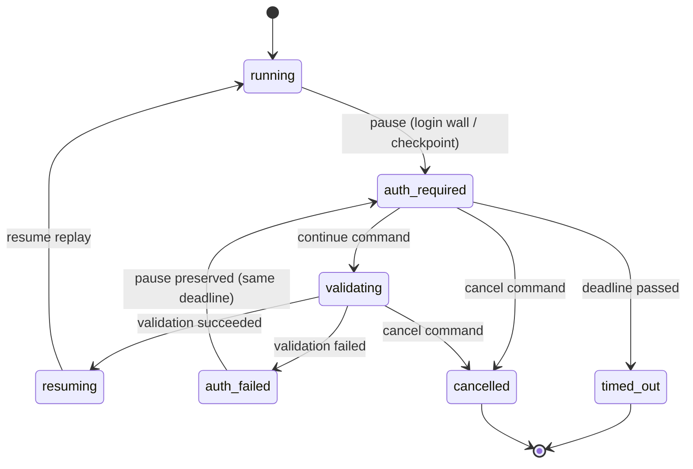
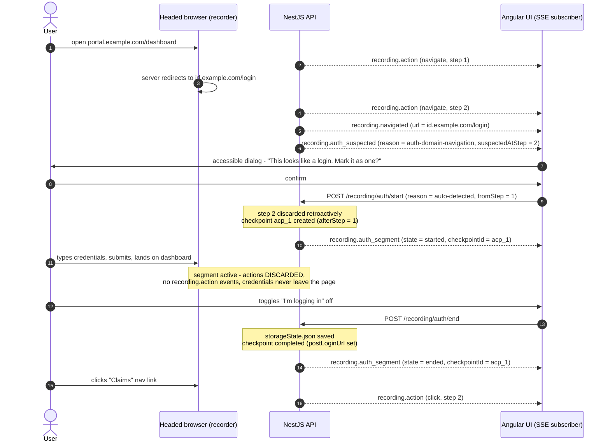
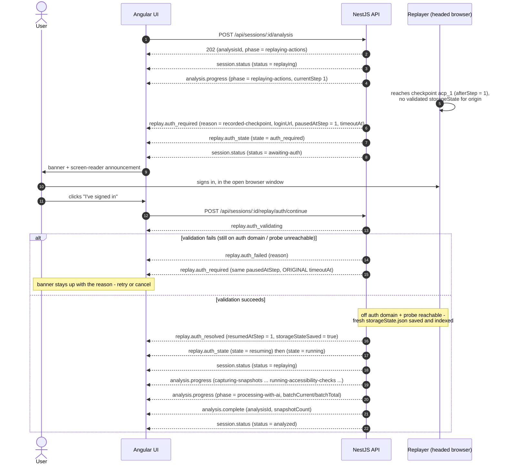

# SSE event catalog

Realtime server→client events for recording, replay/analysis, and pause-for-login. All realtime traffic is Server-Sent Events; client→server commands are plain validated POSTs ([ADR 0003](./adr/0003-sse-over-websocket.md)).

Sources of truth (this document describes them; on any conflict the code wins):

- Payload union: [`packages/shared/src/events/sse-events.schema.ts`](../packages/shared/src/events/sse-events.schema.ts) (`sseEventSchema`)
- Server: NestJS `events` module — `@Sse('sessions/:id/events')`, per-session Subject + ring buffer (rewrite-plan §5)
- Client: `apps/web` `core/api/sse-client.ts` — EventSource wrapper with typed events and a `connectionState` signal

## Transport

- **Endpoint**: `GET /api/sessions/:id/events` (`Content-Type: text/event-stream`).
- **One stream per session.** The stream only ever carries events for session `:id`; there is no cross-session multiplexing. The per-session Subject multicasts, so multiple concurrent subscribers (e.g. two tabs) each receive every event.
- **Wire format**: each SSE message's `id:` field carries a **per-session monotonic integer**; its `data:` field is a JSON object matching `sseEventSchema`. The SSE `event:` field is not used — every message arrives as a default `message` event and the discriminator is the `type` property inside the JSON payload, so a single `onmessage` handler (and a single zod union parse) covers the whole catalog.
- **Ring buffer / resume**: the server keeps the **last 500 events** per session. On reconnect, `EventSource` automatically sends the `Last-Event-ID` request header; the server replays every buffered event with id greater than that value, then continues live. If the client was disconnected for more than 500 events, the oldest part of the gap is unrecoverable from the stream — authoritative state is always re-fetchable over REST (`GET /api/sessions/:id`, `GET /api/sessions/:id/analysis`).
- **Fresh connections** (no `Last-Event-ID`) receive the **full buffer replay from id 1**, then live events — the Angular stores rely on this to recover mid-flow state on a page load or late join.
- **Heartbeat**: every 25 s each subscriber receives a named `event: ping` message (NestJS's `@Sse` writes MessageEvent fields and cannot emit raw `:` comment lines). `EventSource` fires no `onmessage` for unknown named events, and the ping carries no `id:`, so it never advances `Last-Event-ID` — it exists purely to keep proxies from idling out the connection.
- **Reconnect behaviour**: `EventSource` auto-reconnects after a dropped connection (honouring any server-sent `retry:` delay) and resends `Last-Event-ID` without client code. The `SseClient` wrapper exposes a `connectionState` signal so the UI can show a "reconnecting" indicator, and zod-parses every payload at the boundary — an event that fails the union parse is rejected there rather than propagating a malformed object into the stores.

## Catalog

Thirteen event types, one zod discriminated union (`sseEventSchema`). Fields listed are in addition to `type`.

| `type` | Payload fields | Emitted when |
|---|---|---|
| [`recording.action`](#recordingaction) | `action`, `actionCount` | An action is recorded (outside an auth segment) |
| [`recording.navigated`](#recordingnavigated) | `url`, `step?` | The recorded page navigates (main frame) |
| [`recording.auth_suspected`](#recordingauth_suspected) | `reason`, `url`, `suspectedAtStep` | The recorder suspects an unmarked login |
| [`recording.auth_segment`](#recordingauth_segment) | `state`, `checkpointId` | A login segment opens or closes |
| [`analysis.progress`](#analysisprogress) | `phase`, `message`, `currentStep?`, `totalSteps?`, `snapshotCount?`, `batchCurrent?`, `batchTotal?` | Progress within a running analysis |
| [`analysis.complete`](#analysiscomplete) | `analysisId`, `snapshotCount`, `warnings` | Analysis finished successfully |
| [`analysis.error`](#analysiserror) | `message` | Analysis failed |
| [`replay.auth_required`](#replayauth_required) | `checkpointId?`, `reason`, `loginUrl`, `pausedAtStep`, `timeoutAt` | Replay paused for login |
| [`replay.auth_validating`](#replayauth_validating) | — | User's "continue" accepted; validation started |
| [`replay.auth_resolved`](#replayauth_resolved) | `resumedAtStep`, `storageStateSaved` | Validation succeeded; replay resuming |
| [`replay.auth_failed`](#replayauth_failed) | `reason` | Validation failed; replay stays paused |
| [`replay.auth_state`](#replayauth_state) | `state` | Every auth-machine transition (mirror) |
| [`session.status`](#sessionstatus) | `status` | Session lifecycle status changes |

### `recording.action`

| Field | Type | Notes |
|---|---|---|
| `action` | `ActionV2` | The completed action, step and timestamp assigned (see [recording-format.md](./recording-format.md#actionv2)). |
| `actionCount` | integer ≥ 0 | Running total of recorded actions. |

Emitted once per recorded action. **Never emitted for actions performed during an auth segment** — those are discarded before they exist (credential protection, ADR 0005), so the live feed's silence during a login is by design.

UI: appends the action to the live feed on `/sessions/:id/record` (`role="log"` `aria-live="polite"`, virtualized) and updates the action counter.

### `recording.navigated`

| Field | Type | Notes |
|---|---|---|
| `url` | string | New main-frame URL. |
| `step` | integer, optional | Step of the recorded `navigate` action, when one was recorded. Absent when the navigation produced no recorded step (e.g. during an auth segment, where navigations only update the segment's last-seen URL). |

Emitted on main-frame navigations of the recorded browser.

UI: updates the current-URL display on the record page.

### `recording.auth_suspected`

| Field | Type | Notes |
|---|---|---|
| `reason` | `"auth-domain-navigation" \| "password-field"` | What tripped the heuristic: navigation onto a configured auth domain (`config/auth-domains.json`), or focus into a password field. |
| `url` | string | Page URL at detection time. |
| `suspectedAtStep` | integer ≥ 0 | Step of the triggering action — lets the UI start a segment retroactively. |

Emitted when the recorder suspects the user is logging in **without** having marked a segment. Detection assist only — nothing is discarded until the user confirms.

UI: opens an accessible dialog (CDK focus trap) offering to start a login segment retroactively. On confirm, the UI calls `POST /api/sessions/:id/recording/auth/start` with `reason: "auto-detected"` and a `fromStep` derived from `suspectedAtStep` so the triggering navigation/actions are folded into the segment (retroactively discarded); the response reports `discardedActions`. On decline, recording continues unchanged (values typed into sensitive fields are still redacted at the source).

### `recording.auth_segment`

| Field | Type | Notes |
|---|---|---|
| `state` | `"started" \| "ended"` | Segment lifecycle. |
| `checkpointId` | string | The `AuthCheckpoint.id` this segment persists as. |

Emitted when a login segment opens (`POST .../recording/auth/start`, whether user-marked or a confirmed auto-detect) and when it closes (`POST .../recording/auth/end`). At `ended`, `storageState.json` has been saved and the checkpoint carries `postLoginUrl`/`completedAt`.

UI: while the segment is open, shows a prominent "login in progress — actions are not being recorded" indicator (the mark-login toggle's active state); on `ended`, renders a checkpoint marker in the action feed where the discarded login happened.

### `analysis.progress`

| Field | Type | Notes |
|---|---|---|
| `phase` | `"replaying-actions" \| "capturing-snapshots" \| "running-accessibility-checks" \| "processing-with-ai" \| "generating-report" \| "completed"` | v1 phase vocabulary, kept deliberately. |
| `message` | string | Human-readable progress line. |
| `currentStep` | integer, optional | Current replay/snapshot step. |
| `totalSteps` | integer, optional | Total steps for the phase. |
| `snapshotCount` | integer, optional | Snapshots captured so far. |
| `batchCurrent` | integer, optional | Current LLM batch (`processing-with-ai`). |
| `batchTotal` | integer, optional | Total LLM batches. |

Emitted throughout a running analysis (`POST /api/sessions/:id/analysis` returns 202; all progress arrives here).

UI: drives the three-phase progress view on `/sessions/:id/analyze`; phase transitions are announced politely via the CDK LiveAnnouncer.

### `analysis.complete`

| Field | Type | Notes |
|---|---|---|
| `analysisId` | string | Identifier of the completed analysis. |
| `snapshotCount` | integer | Snapshots captured. |
| `warnings` | string[] (defaults `[]`) | Non-fatal issues (e.g. skipped steps, truncation notes). |

Emitted once when the analysis finishes and `analysis.json` has been persisted.

UI: fetches the result (`GET /api/sessions/:id/analysis`) and navigates to `/sessions/:id/results`; surfaces `warnings` non-modally.

### `analysis.error`

| Field | Type | Notes |
|---|---|---|
| `message` | string | Failure description. |

Emitted when the analysis aborts (engine error, LLM failure that cannot degrade, cancelled/timed-out auth pause). A `session.status` event (`failed`) follows.

UI: error banner on the analyze page with a retry affordance; announced assertively.

### `replay.auth_required`

| Field | Type | Notes |
|---|---|---|
| `checkpointId` | string, optional | Present when the pause honours a recorded checkpoint (`reason: "recorded-checkpoint"`). |
| `reason` | `"recorded-checkpoint" \| "auth-domain-navigation" \| "login-wall-detected"` | Why replay paused: reached `authCheckpoint.afterStep` with no validated storage state; navigation landed on a configured auth domain; or the login-wall heuristic fired (password field present and target candidates failing to resolve). |
| `loginUrl` | string | Always known: the recorded checkpoint URL or the live page URL at pause time. |
| `pausedAtStep` | integer | Step the replay stopped at; replay resumes from here on success. |
| `timeoutAt` | string (ISO 8601) | Deadline after which the pause expires to `timed_out`. Default budget 10 min (`REPLAY_AUTH_TIMEOUT_MS`). Not extended by failed validations. |

Emitted when the auth-checkpoint machine transitions `running → auth_required`. The headed browser is kept alive on the login page. Also re-emitted after a failed validation (the machine loops `auth_failed → auth_required` and the pause context, including the original `timeoutAt`, is preserved).

UI: shows the auth-checkpoint banner on the analyze page with the login URL and a countdown to `timeoutAt`, announces it to screen readers, and offers "I've signed in" (`POST /api/sessions/:id/replay/auth/continue`) and "Cancel" (`POST .../replay/auth/cancel`). The user signs in **in the open browser window**, not in the web UI — credentials never pass through the app.

### `replay.auth_validating`

No payload fields beyond `type`.

Emitted when the continue command is accepted (`auth_required → validating`): the server is checking that the browser is off the auth domain and a probe of the target origin succeeds.

UI: banner switches to a "validating sign-in…" state; the continue button is disabled to prevent double submission.

### `replay.auth_resolved`

| Field | Type | Notes |
|---|---|---|
| `resumedAtStep` | integer | Step the replay resumes from (the step it paused at). |
| `storageStateSaved` | boolean | Whether a fresh `storageState.json` was saved (and indexed for cross-session reuse). |

Emitted when validation succeeds (`validating → resuming → running`). The recorded checkpoint tied to this pause is consumed — the same `afterStep` never pauses the replay twice.

UI: dismisses the banner, announces resumption, and returns to progress display.

### `replay.auth_failed`

| Field | Type | Notes |
|---|---|---|
| `reason` | string | Why validation failed (e.g. still on the auth domain, probe unreachable). |

Emitted when validation fails. `auth_failed` is momentary: the machine immediately loops back to `auth_required` (a fresh `replay.auth_required` follows), keeping the original timeout deadline.

UI: keeps the banner up with the failure reason; the user can retry signing in or cancel.

### `replay.auth_state`

| Field | Type | Notes |
|---|---|---|
| `state` | `"running" \| "auth_required" \| "validating" \| "resuming" \| "auth_failed" \| "cancelled" \| "timed_out"` | `ReplayAuthState` from `@waa/shared`. |

Emitted on **every** transition of the auth-checkpoint machine, mirroring the detailed `replay.auth_*` events. It is the only event that carries the terminal states `cancelled` and `timed_out`, and it lets a reconnecting client resynchronize the machine state from the latest value alone rather than replaying the detailed sequence.

State graph (`packages/engine/src/replay/auth-checkpoint.ts`; `resuming` and `auth_failed` are momentary — the machine emits them and immediately moves on within the same call):

UI: the `auth` signal store keeps the current state; route guards and the banner derive from it.

### `session.status`

| Field | Type | Notes |
|---|---|---|
| `status` | `"recording" \| "recorded" \| "replaying" \| "awaiting-auth" \| "analyzing" \| "analyzed" \| "failed" \| "interrupted"` | `SessionStatus` from `@waa/shared`. |

Emitted whenever the session's lifecycle status changes (recording started/stopped, analysis started, replay paused for auth → `awaiting-auth`, completion, failure, or an interrupted session detected after an API restart).

UI: feeds the `sessions` store — status badges in the session browser, route guards (e.g. results only when `analyzed`), and recovery after reconnect/restart.

## Sequence walkthroughs

### (a) Recording with an auto-detected login segment

The recorder notices an unmarked login (`recording.auth_suspected`), the user confirms, and the segment is started retroactively — the navigation onto the login page is discarded and folded into checkpoint `acp_1`. Matches the recording-side flow in rewrite-plan §6; the resulting file is the [annotated v2 example](./recording-format.md#annotated-v2-example).

### (b) Analysis replay hitting a login wall

Replay (the first stage of every analysis) reaches recorded checkpoint `acp_1` with no validated storage state for the target origin, pauses, and resumes after the user signs in. Matches the auth-checkpoint state machine in rewrite-plan §6; every machine transition is mirrored by a `replay.auth_state` event (omitted below except where load-bearing).

Not shown: `cancel` (`POST .../replay/auth/cancel`) from the paused state aborts cleanly — partial snapshots are kept and the manifest notes truncation (`truncated`/`truncationReason`); a pause that outlives `timeoutAt` expires to `timed_out`. Both surface via `replay.auth_state` (`cancelled`/`timed_out`), after which the pipeline completes normally on the partial data: `analysis.complete` with `success: true`, a truncated manifest and warnings, and `session.status` `analyzed`. `analysis.error` is reserved for real failures (launch errors, unrecoverable replay faults).
